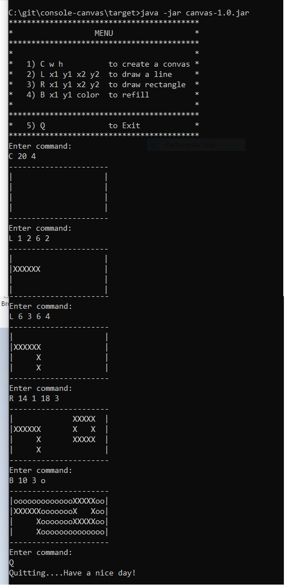
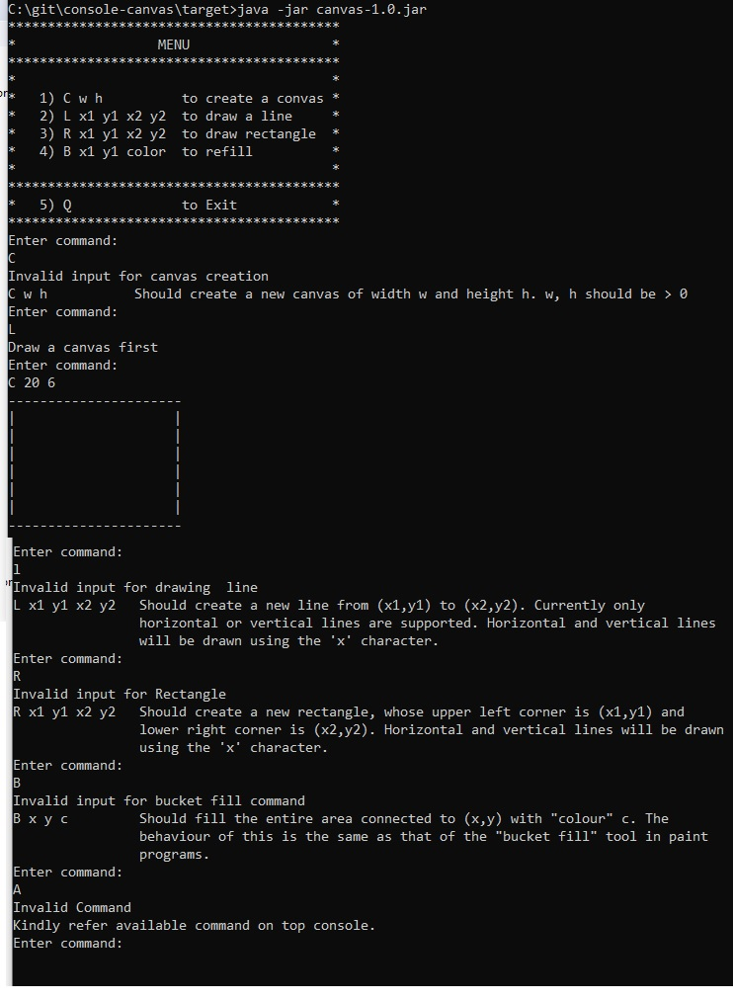

# console-canvas
---------------------------------------------
Simple console version of a drawing program

# Assumptions
---------------------------------------------
1)JDK path is set 

2)MAVAN related path is set (e.g mvn command is working )

# Run
---------------------------------------------
1)First compile the code using below MAVEN command
`mvn clean install`

2)Run below command from directory where canvas-1.0.jar file is present (i.e target directory)
`java -jar canvas-1.0.jar`

# Output
---------------------------------------------
`1)Output with all valid inputs`

`2)Output with invalid inputs`

`---------------------------------------------`
`Happy testing :)`
`---------------------------------------------`
